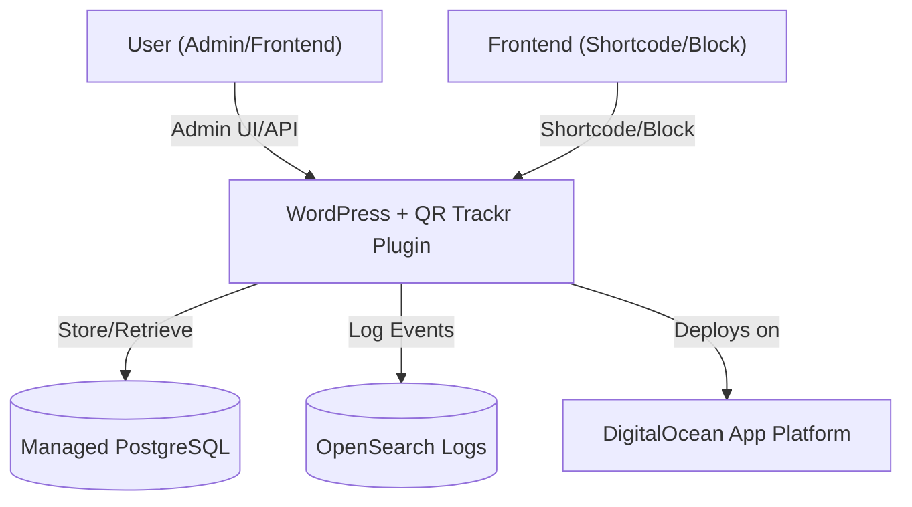

# QR Trackr Plugin Template 🚀

A modern, production-ready WordPress plugin template—featuring QR Trackr as an example. Built for professional development, extensibility, and team/enterprise adoption.

---

## Table of Contents
1. [Project Overview](#project-overview)
2. [Quick Start / Onboarding](#quick-start--onboarding)
3. [Usage](#usage)
4. [Development & Contribution](#development--contribution)
5. [Infrastructure & Plumbing](#infrastructure--plumbing)
6. [For Engineering & IT Leadership](#for-engineering--it-leadership)
7. [Troubleshooting & FAQ](#troubleshooting--faq)
8. [Links & Further Reading](#links--further-reading)

---

## Project Overview

**QR Trackr** is a WordPress plugin for generating and tracking QR codes for posts, pages, and custom URLs. This repository also serves as a robust template for building any modern WordPress plugin.

**Key Features:**
- Modern, scalable plugin structure
- Secure, maintainable, and extensible codebase
- Hooks/filters for free/pro separation
- Mobile-first, accessible admin UI
- Automated setup and testing
- DigitalOcean App Platform compatibility
- Example project plans and automation scripts

---

## Quick Start / Onboarding

### Prerequisites
- macOS (ARM or x86), Linux, or Windows (see project plans for cross-platform support)
- [Homebrew](https://brew.sh/) (macOS)
- [Yarn](https://yarnpkg.com/)
- [Composer](https://getcomposer.org/)
- Docker (for local dev/testing)

### Setup Steps
1. **Clone the repository:**
   ```sh
   git clone <your-fork-or-this-repo-url>
   cd wp-qr-trackr
   ```
2. **Run the setup script (macOS):**
   ```sh
   chmod +x setup-macos.sh
   ./setup-macos.sh
   ```
3. **Install dependencies:**
   ```sh
   yarn install
   composer install
   ```
4. **Set up your environment:**
   ```sh
   cp .env.example .env
   # Edit .env as needed
   ```
5. **Run tests:**
   ```sh
   ./vendor/bin/phpunit
   ```
6. **Start Docker for local WordPress:**
   ```sh
   docker compose up --build
   ```

---

## Usage

### As a QR Trackr User
- Access the QR Trackr admin panel in WordPress to generate and track QR codes.
- Use the `[qr_trackr]` shortcode to generate QR codes on the frontend (see documentation for parameters).
- View analytics and performance at a glance in the admin dashboard.

### As a Plugin Template
- Use this structure as a starting point for any WordPress plugin.
- Swap out QR code logic for your own features.
- Extend with premium/pro features using the provided hooks and filters.

---

## Development & Contribution

- All changes must be made on a feature branch and submitted via PR.
- Documentation and tests are required for all new features.
- See `.cursorrules` for project standards and best practices.
- Use the provided project plans and automation scripts for team/project management.
- Run `./scripts/pr-summary-comment.sh <PR_NUMBER> [SUMMARY_TEXT]` to automate PR summary comments.
- See `CONTRIBUTING.md` for more details and a living task tracker.

---

## Infrastructure & Plumbing

**Core Components:** Homebrew, PHP, Yarn, Composer, Xdebug, Docker

**Cloud Integrations:** DigitalOcean App Platform, Managed PostgreSQL, OpenSearch

**Scripts:**
- `setup-macos.sh`: Automated setup for macOS
- `fix-pecl-xdebug.sh`: Ensures Xdebug installs cleanly
- `create-github-project-tasks.sh`: Automates project board population
- `pr-summary-comment.sh`: Automates PR summary comments

**How it fits together:**
- Setup scripts check/install all dependencies
- `.env.example` documents all required environment variables
- CI/CD (planned) will enforce requirements and run tests

---

## For Engineering & IT Leadership

### Architecture Diagram


### Compliance & Security
- Data privacy: All sensitive data in managed PostgreSQL, access via env vars
- Audit logging: All events/errors to OpenSearch
- Access control: Only authenticated admins access analytics/settings
- Secrets management: No hardcoded secrets; all via env vars
- Code review: All changes require PRs, review, and up-to-date docs
- Cloud compliance: DigitalOcean services, adaptable to other providers

### Scalability, Maintainability, Team Building
- Modular, extensible architecture
- Hooks/filters for easy extension
- Automated onboarding and project/task board scripts
- Supports cross-functional teams and mentorship

---

## Troubleshooting & FAQ
- **Xdebug/PECL issues:** Run `fix-pecl-xdebug.sh`
- **Database/logging issues:** Check `.env` values and DigitalOcean status
- **Docker issues:** Ensure Docker is running and ports are available
- **General:** See CONTRIBUTING.md or open an issue

---

## Links & Further Reading
- [DigitalOcean App Platform](https://www.digitalocean.com/products/app-platform/)
- [WordPress Plugin Handbook](https://developer.wordpress.org/plugins/)
- [Yarn](https://yarnpkg.com/)
- [Composer](https://getcomposer.org/)
- [PHPUnit](https://phpunit.de/)
- [OpenSearch](https://opensearch.org/)

---

Whether you're here to improve QR Trackr or to launch your own plugin, you're set up for success. Happy coding!

# WordPress Plugin Template

This repository serves as a professional starting point for developing secure, elegant, and mobile-first WordPress plugins.

## Features & Standards
- **Professional WordPress Best Practices**: All plugins are built with industry-leading standards for security, maintainability, and performance.
- **Excellent Security**: Follows strict security guidelines to protect your WordPress site and data.
- **Elegant, Maintainable Code**: Code is structured for clarity, extensibility, and ease of maintenance.
- **Debug Logging**: Debug logging is available and can be enabled upon request for troubleshooting and development.
- **Mobile-First UI**: Both generator functions and wp-admin panes are styled for optimal experience on all devices, prioritizing mobile usability.

## Using This Template with Cursor

1. **Clone the Repository**
   ```sh
   git clone <your-repo-url>
   cd <your-repo-directory>
   ```
2. **Open in Cursor**
   - Launch [Cursor](https://cursor.so/) and open this directory.
3. **Customize Your Plugin**
   - Rename the plugin directory and files as needed.
   - Update the plugin headers in the main PHP file.
   - Implement your custom functionality, following the standards in `.cursorrules`.
4. **Development Workflow**
   - Use Cursor's AI features to generate, refactor, and document code.
   - Commit changes regularly.
   - Test your plugin in a local or staging WordPress environment.
5. **Debug Logging**
   - Enable debug logging as needed for troubleshooting (see `$lib/utils/debug.ts` or your plugin's debug utility).

## About the Template Author

This template is maintained by a professional WordPress developer specializing in secure, elegant, and mobile-first plugin development. For questions or contributions, please open an issue or pull request.

## Recommended Workflow: Branching, Documentation, and PRs

To maintain high standards and clear project history, follow this workflow for all changes:

1. **Create a New Branch**
   - For each new feature or fix, create a dedicated branch from `main`:
     ```sh
     git checkout -b feature/your-feature-name
     ```
2. **Update Documentation**
   - Update the `README.md` and other relevant documentation files with every code change or new feature.
   - Ensure documentation accurately reflects the current state of the codebase.
3. **Commit Changes**
   - Write clear, descriptive commit messages.
   - Example:
     ```sh
     git add .
     git commit -m "Add feature X with updated documentation"
     ```
4. **Push to Remote**
   - Push your branch to the remote repository:
     ```sh
     git push origin feature/your-feature-name
     ```
5. **Open or Update a Pull Request (PR)**
   - Open a PR from your branch into `main`.
   - If you make further changes, push them to the same branch; the PR will update automatically.
   - Reviewers should verify that documentation is up to date before merging.

This workflow ensures code and documentation remain synchronized, improving maintainability and onboarding for new contributors.

## Local Development with Docker

You can run this WordPress plugin template locally using Docker. This will spin up both a WordPress instance and a MySQL database, making it easy to test your plugin in a real environment.

### Prerequisites
- [Docker](https://www.digitalocean.com/community/tutorial_series/docker-explained) must be installed on your system. If you need help, see this guide: [How To Install and Use Docker](https://www.digitalocean.com/community/tutorials/how-to-install-and-use-docker-on-mac-os-x).

### Steps
1. **Copy the example environment file:**
   ```sh
   cp .env.example .env
   # Edit .env to set your local secrets if needed
   ```
2. **Initialize the Docker environment:**
   ```sh
   ./scripts/init-docker.sh
   ```
   This script will check if port 8080 is free, stop any Docker container using it, and start the environment.

3. **Access WordPress:**
   - Open your browser and go to [http://localhost:8080](http://localhost:8080)
   - Complete the WordPress setup wizard if prompted.

4. **Develop Your Plugin:**
   - Place your plugin code in `wp-content/plugins` (mounted automatically).
   - Activate and test your plugin from the WordPress admin panel.

### Stopping the Environment
To stop the containers, press `Ctrl+C` in the terminal running Docker, or run:
```sh
docker-compose down
```

## QR Code Shapes (Extensible)

QR Trackr now supports a `shape` parameter for QR code generation. By default, only the standard shape is available, but the Pro plugin (or other plugins) can register new shapes and custom QR code renderers.

### Usage
- The `qr_trackr_generate_qr_image` and `qr_trackr_generate_qr_image_for_link` functions accept a `$shape` parameter.
- Use the `qr_trackr_get_available_shapes()` function to get all registered shapes.

### Extending with Pro
- Pro or other plugins can add new shapes via the `qr_trackr_qr_shapes` filter:

```php
add_filter('qr_trackr_qr_shapes', function($shapes) {
    $shapes['animal_head'] = __('Animal Head', 'qr-trackr-pro');
    return $shapes;
});
```

- To generate custom QR code images for new shapes, use the `qr_trackr_generate_custom_shape` filter:

```php
add_filter('qr_trackr_generate_custom_shape', function($custom, $url, $size, $shape, $filepath) {
    if ($shape === 'animal_head') {
        // Generate and save custom QR code to $filepath
        // ...
        return true; // Indicate handled
    }
    return $custom;
}, 10, 5);
```

- If the filter returns `null`, the core plugin will fall back to the standard QR code.

---

## Pro Version

The Pro add-on can:
- Register new shapes and custom QR code renderers.
- Provide advanced QR code styles, overlays, and more.
- Integrate with the shape system via the documented filters.

See the Pro plugin documentation for more details.

## Xdebug Installation on macOS (ARM & x86)

### Why This Script is Needed
On macOS, especially with Homebrew-managed PHP installations (both Apple Silicon/ARM and Intel/x86), PECL sometimes fails to install extensions like Xdebug due to symlinked directories. Homebrew creates a symlink for the `pecl` directory (e.g., `/opt/homebrew/Cellar/php/8.4.8/pecl`), which points to a shared location (e.g., `/opt/homebrew/lib/php/pecl`). When PECL tries to create subdirectories for extensions, it may encounter errors if the directory already exists or if there are permission issues, resulting in errors like:

```
Warning: mkdir(): File exists in System.php on line 294
ERROR: failed to mkdir /opt/homebrew/Cellar/php/8.4.8/pecl/20240924
```

This affects both ARM (Apple Silicon) and x86 (Intel) Macs using Homebrew.

### How It Was Fixed
The `fix-pecl-xdebug.sh` script:
- Checks that the `pecl` path is a symlink.
- Ensures the target directory exists and has the correct permissions.
- Attempts to install Xdebug via PECL.
- Falls back to Homebrew installation if PECL fails.

### Usage
1. Make the script executable:
   ```sh
   chmod +x fix-pecl-xdebug.sh
   ```
2. Run the script:
   ```sh
   ./fix-pecl-xdebug.sh
   ```

This script is compatible with both ARM and x86 Homebrew installations. It should be included as part of the standard setup for local development on macOS.

## Infrastructure & Project Plumbing

This section explains the underlying infrastructure, dependencies, and how everything fits together so anyone can run the project from scratch.

### Core Components
- **Homebrew**: Used for installing system dependencies (macOS).
- **PHP**: The main runtime for WordPress and the plugin. Installed via Homebrew.
- **Yarn**: JavaScript package manager for frontend/admin assets. Required for building and managing JS dependencies.
- **Composer**: PHP dependency manager. Used for installing PHP libraries and tools (e.g., PHPUnit).
- **Xdebug**: PHP extension for debugging and code coverage. Installed via PECL/Homebrew, with setup scripts to fix common macOS issues.

### Cloud & Platform Integrations
- **DigitalOcean App Platform**: The recommended deployment target. Ensures compatibility for cloud hosting.
- **DigitalOcean Managed PostgreSQL**: Used for plugin data storage and analytics.
- **OpenSearch (DigitalOcean Managed)**: For forwarding and searching system logs.

### Project Scripts & Automation
- **setup-macos.sh**: One-step setup for macOS (ARM & x86). Installs Homebrew, PHP, Xdebug, and runs all required fixes.
- **fix-pecl-xdebug.sh**: Ensures Xdebug installs cleanly with Homebrew PHP/PECL on macOS.
- **create-github-project-tasks.sh**: Automates project board population for GitHub Projects.

### Environment Variables
- All required environment variables are documented in `.env.example`. Copy this to `.env` and fill in your values.

### How It All Fits Together
1. **Clone the repository**
2. **Run the setup script** (`./setup-macos.sh`) to install all system dependencies and fix PHP/Xdebug issues.
3. **Install JS dependencies** with `yarn install`.
4. **Install PHP dependencies** with `composer install`.
5. **Set up your environment** by copying `.env.example` to `.env` and filling in any required secrets or connection strings (e.g., PostgreSQL, OpenSearch).
6. **Run tests** to verify your environment: `./vendor/bin/phpunit`.
7. **Start Docker for local WordPress:**
   ```sh
   docker compose up --build
   ```

### Required Components & How They're Enforced
- **Scripts check for required tools** (Homebrew, PHP, Yarn, Composer) and prompt to install if missing.
- **.env.example** lists all required environment variables; setup scripts can check for their presence.
- **CI/CD pipelines** (planned) will verify that all dependencies are installed and configured before allowing merges.

### Troubleshooting
- If you hit issues with Xdebug or PECL, always run `fix-pecl-xdebug.sh`.
- For database or logging issues, check your `.env` values and DigitalOcean service status.

---

## For Engineering & IT Leadership

This project is designed with professional, enterprise, and organizational needs in mind. Key considerations for Directors of Engineering, IT, and similar roles:

### Architecture Diagram

Below is a high-level overview of the infrastructure and data flow for QR Trackr:


- **User** interacts with the admin or frontend UI.
- **WordPress + QR Trackr** handles QR code generation, analytics, and admin features.
- **Managed PostgreSQL** stores QR code data and analytics.
- **OpenSearch** receives logs for monitoring and audit.
- **DigitalOcean App Platform** hosts the application.
- **Frontend** can generate QR codes via shortcodes or blocks.

### Compliance Considerations
- **Data Privacy:** All sensitive data (e.g., analytics, user info) is stored in managed PostgreSQL with access controlled via environment variables.
- **Audit Logging:** All significant events and errors are forwarded to OpenSearch for centralized, tamper-evident logging.
- **Access Control:** Only authenticated WordPress admins can access plugin settings and analytics. Frontend QR code generation is permissioned via shortcode attributes.
- **Secrets Management:** No secrets are hardcoded; all credentials are managed via environment variables and `.env` files (never committed).
- **Code Quality & Review:** All changes require PRs, code review, and up-to-date documentation, supporting traceability and compliance audits.
- **Cloud Compliance:** DigitalOcean services are used for managed, compliant infrastructure. The project can be adapted for other compliant cloud providers.

### Team Building & Collaboration Opportunities
- **Modular Codebase:** Teams can own different modules (admin UI, analytics, frontend, integrations) and contribute independently.
- **Extensible Template:** Use this as a base for new plugins, fostering shared standards and reusable components across projects.
- **Automated Onboarding:** New team members can get started quickly with setup scripts and clear documentation.
- **Project Board Automation:** Use the provided scripts to create and manage project boards, making it easy to assign, track, and celebrate team contributions.
- **Mentorship & Growth:** Encourage junior developers to take on well-defined tasks (see CONTRIBUTING.md and project plans) and learn best practices in WordPress, PHP, and cloud development.
- **Cross-Functional Collaboration:** The project's structure supports collaboration between backend, frontend, DevOps, and QA roles.

---

This project is ready for adoption by teams and organizations that value security, maintainability, and modern development practices. For further details or to discuss enterprise integration, please open an issue or contact the maintainers.

---
