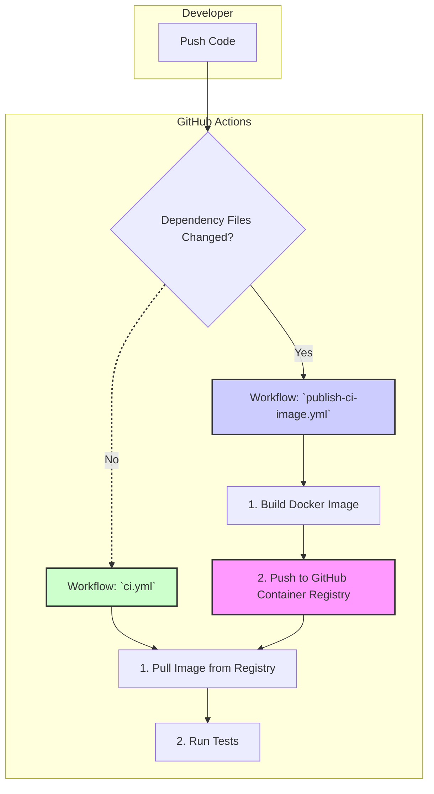

# wp-qr-trackr Nonprod (QA/Staging) Guide

> **Note:** Sections marked with [COMMON] are shared with dev and production documentation.

## [COMMON] Project Overview
wp-qr-trackr is a modular, robust WordPress plugin for QR code generation and tracking. It is open source and built entirely via prompt engineering and Cursor's Agent Mode.

## Nonprod Docker Environment
- Uses a dedicated Docker Compose file for a clean, vanilla WordPress + MySQL stack.
- No live-mounts: plugin ZIPs are uploaded via the WP admin for true production-like testing.
- Runs on port 8081 by default to avoid conflicts with dev.
- Use `launch-nonprod-docker.sh` to start, and `reset-nonprod-docker.sh` to reset the environment.
- PHP upload limits are increased via a custom `php.ini` for large plugin ZIPs.

## [COMMON] Plugin Structure
- Modular includes: admin, AJAX, rewrite, debug, utility, etc.
- Main plugin file only bootstraps modules.
- All business logic is in `includes/` modules.

## [COMMON] Coding Standards
- WordPress Coding Standards enforced via PHPCS.
- PHPCS requires at least 1GB RAM, 4GB recommended for large codebases (see `.cursorrules`).
- All code must pass CI/CD before merging.

## QA Workflow
- Upload release ZIPs to the nonprod WP admin for testing.
- Use the reset script to clear the database and start fresh.
- Test all plugin features, including admin UI, AJAX, and QR code generation.

## [COMMON] Security Practices
- Separate nonces for all admin AJAX actions.
- Strict capability checks for all sensitive actions.

## [COMMON] Release Process
- Automated build script ensures only required files are included.
- Release ZIP is verified for required/forbidden files.
- Releases are published to GitHub with full changelogs.

## [COMMON] Contributor Notes
- See `.cursorrules` for project rules and environment requirements.
- All major documentation files have parallel dev, nonprod, and prod versions.

## See also
- `README.dev.md` for local development.
- `README.prod.md` for production deployment and usage.

## All-in-One Environment

For advanced testing, you can start dev, nonprod, and a local GitHub MCP server together with:

```sh
./scripts/launch-all-docker.sh
```

See the dev README for details on MCP and its role in repo automation and merge conflict prevention. 

### CI/CD Pipeline: A Pre-Built Container Approach

To accelerate testing and improve reliability, this project uses a sophisticated CI/CD architecture based on a pre-built Docker container. Instead of building the testing environment from scratch on every run, the pipeline pulls a stable, versioned CI container from the GitHub Container Registry (GHCR).

This approach provides two key benefits:
- **Speed:** CI checks start almost instantly, as the time-consuming step of building the Docker image is eliminated from the main workflow.
- **Reliability:** It completely avoids Docker caching issues and ensures that every test run—whether in CI or locally—uses the exact same, consistent environment.

#### Architecture Overview



#### How It Works

The system is composed of two distinct GitHub Actions workflows:

1.  **`publish-ci-image.yml` (The Builder)**
    - **Purpose:** To build and publish the CI Docker image.
    - **Trigger:** This workflow runs *only* when files defining the CI environment are changed on the `main` branch (e.g., `Dockerfile.ci`, `composer.json`, `package.json`).
    - **Action:** It builds the `ci-runner` image and pushes it to the GitHub Container Registry, where it becomes the new standard for testing.

2.  **`ci.yml` (The Tester)**
    - **Purpose:** To run all linting and testing checks on the code.
    - **Trigger:** Runs on every push and pull request.
    - **Action:**
        - It logs into the GitHub Container Registry.
        - It uses `docker-compose.ci.yml` to pull the pre-built `ci-runner` image.
        - It executes the `ci.sh` script inside the container to run all checks.

This separation of concerns ensures that the time-intensive build process only happens when absolutely necessary, making the day-to-day development and testing cycle fast and efficient.

### Modular Linting & Formatting Configuration

To ensure code quality and consistency across all contributors and environments, this project uses a modular, extensible lint-staged configuration. This setup automatically lints and formats all relevant file types before each commit, using the right tool for each language or format. 

**Key points:**
- No `cd` commands are used in config files, avoiding path confusion and automation issues.
- All linting/formatting is run from the project root, ensuring compatibility with Husky, lint-staged, and CI/CD.
- The configuration is easily extendable for new file types or tools.
- This approach enforces standards, reduces review friction, and prevents common pitfalls in cross-platform and modular setups.

**Current `.lintstagedrc.json` config:**
```json
{
  "*.js": "eslint --fix",
  "*.jsx": "eslint --fix",
  "*.ts": "eslint --fix",
  "*.tsx": "eslint --fix",
  "*.php": "phpcbf",
  "*.css": "stylelint --fix",
  "*.scss": "stylelint --fix",
  "*.json": "prettier --write",
  "*.md": "prettier --write",
  "*.yml": "prettier --write",
  "*.yaml": "prettier --write"
}
```

**What each tool does:**
- `eslint --fix`: Lints and auto-formats JavaScript, JSX, TypeScript, and TSX files.
- `phpcbf`: Applies WordPress and project PHP coding standards automatically.
- `stylelint --fix`: Lints and auto-formats CSS and SCSS files.
- `prettier --write`: Formats JSON, Markdown, and YAML files for consistency.

**Significance:**
- **Reliability:** Avoids automation pitfalls (like infinite loops from `cd` in configs).
- **Consistency:** All code and docs are auto-formatted before commit.
- **Modularity:** Easy to add new file types or tools as the project grows.
- **Cross-platform:** Works on macOS, Linux, and CI/CD without modification.

See `scripts/.lintstagedrc.json` for the authoritative config. Update this file if you add new file types or want to change linting/formatting tools. 