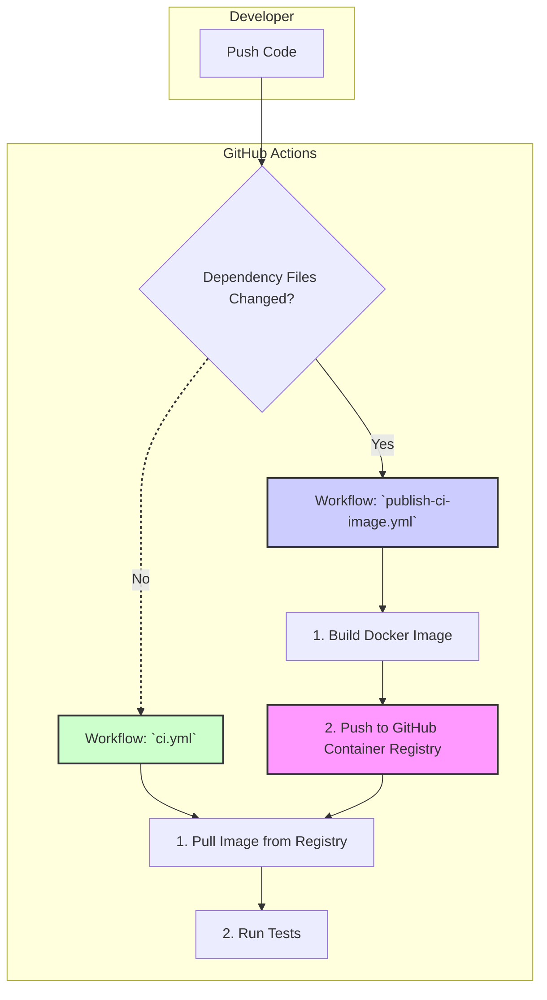
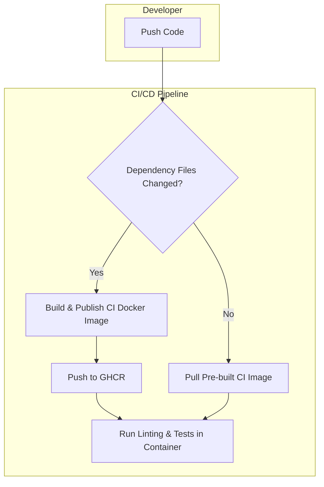
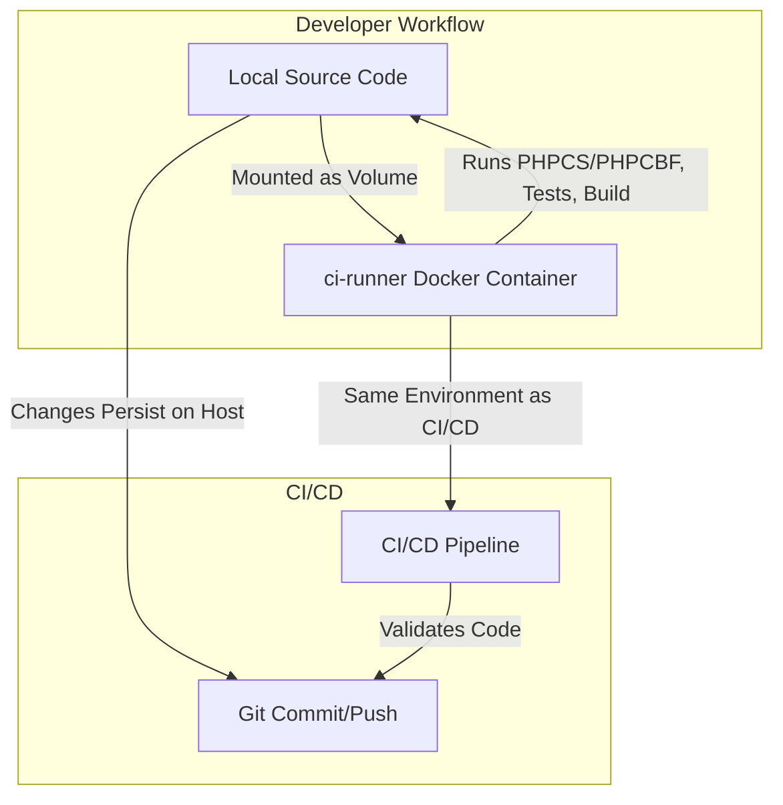

# QR Trackr Plugin Template (Production)

A modern, production-ready WordPress plugin template—featuring QR Trackr as an example. This version of the documentation is focused on secure, stable, and performant production deployment.

## Table of Contents
1. Project Overview
2. Quick Start / Onboarding (Production)
3. Usage
4. Production Deployment & Configuration
5. Infrastructure & Plumbing
6. Troubleshooting & FAQ (Production)
7. Links & Further Reading

---

## Project Overview

**QR Trackr** is a WordPress plugin for generating and tracking QR codes for posts, pages, and custom URLs. This repository also serves as a robust template for building any modern WordPress plugin.

**Key Features:**
- Modular, scalable plugin structure
- Secure, maintainable, and extensible codebase
- Hooks/filters for free/pro separation
- Mobile-first, accessible admin UI
- Automated setup and testing
- Comprehensive PHPUnit test suite
- DigitalOcean App Platform compatibility
- Example project plans and automation scripts

---

## Quick Start / Onboarding (Production)

# 🚀 Production Onboarding: Container-Only Workflow

**Requirements:**
- Docker Desktop (latest)
- Git

**All production validation, linting, and testing should be run in the Docker container.**
No need to install PHP, Composer, Node, or CLI tools on your host.

### Prerequisites
- DigitalOcean App Platform account
- WordPress-compatible hosting
- [Yarn](https://yarnpkg.com/)
- [Composer](https://getcomposer.org/)

### Production Setup Steps
1. **Clone the repository and build the plugin as per release instructions.**
2. **Deploy WordPress to DigitalOcean App Platform or your production host.**
3. **Upload the built plugin zip via the WordPress admin or deploy as part of your CI/CD pipeline.**
4. **Configure environment variables and secrets in the DigitalOcean App Platform dashboard.**
5. **Ensure debug mode is disabled in production.**

### CI/CD Pipeline: A Pre-Built Container Approach

To accelerate testing and improve reliability, this project uses a sophisticated CI/CD architecture based on a pre-built Docker container. Instead of building the testing environment from scratch on every run, the pipeline pulls a stable, versioned CI container from the GitHub Container Registry (GHCR).

This approach provides two key benefits:
- **Speed:** CI checks start almost instantly, as the time-consuming step of building the Docker image is eliminated from the main workflow.
- **Reliability:** It completely avoids Docker caching issues and ensures that every test run—whether in CI or locally—uses the exact same, consistent environment.

#### Architecture Overview



#### How It Works

The system is composed of two distinct GitHub Actions workflows:

1.  **`publish-ci-image.yml` (The Builder)**
    - **Purpose:** To build and publish the CI Docker image.
    - **Trigger:** This workflow runs *only* when files defining the CI environment are changed on the `main` branch (e.g., `Dockerfile.ci`, `composer.json`, `package.json`).
    - **Action:** It builds the `ci-runner` image and pushes it to the GitHub Container Registry, where it becomes the new standard for testing.

2.  **`ci.yml` (The Tester)**
    - **Purpose:** To run all linting and testing checks on the code.
    - **Trigger:** Runs on every push and pull request.
    - **Action:**
        - It logs into the GitHub Container Registry.
        - It uses `docker-compose.ci.yml` to pull the pre-built `ci-runner` image.
        - It executes the `ci.sh` script inside the container to run all checks.

This separation of concerns ensures that the time-intensive build process only happens when absolutely necessary, making the day-to-day development and testing cycle fast and efficient.

### Modular Linting & Formatting Configuration

To ensure code quality and consistency across all contributors and environments, this project uses a modular, extensible lint-staged configuration. This setup automatically lints and formats all relevant file types before each commit, using the right tool for each language or format. 

**Key points:**
- No `cd` commands are used in config files, avoiding path confusion and automation issues.
- All linting/formatting is run from the project root, ensuring compatibility with Husky, lint-staged, and CI/CD.
- The configuration is easily extendable for new file types or tools.
- This approach enforces standards, reduces review friction, and prevents common pitfalls in cross-platform and modular setups.

**Current `.lintstagedrc.json` config:**
```json
{
  "*.js": "eslint --fix",
  "*.jsx": "eslint --fix",
  "*.ts": "eslint --fix",
  "*.tsx": "eslint --fix",
  "*.php": "phpcbf",
  "*.css": "stylelint --fix",
  "*.scss": "stylelint --fix",
  "*.json": "prettier --write",
  "*.md": "prettier --write",
  "*.yml": "prettier --write",
  "*.yaml": "prettier --write"
}
```

**What each tool does:**
- `eslint --fix`: Lints and auto-formats JavaScript, JSX, TypeScript, and TSX files.
- `phpcbf`: Applies WordPress and project PHP coding standards automatically.
- `stylelint --fix`: Lints and auto-formats CSS and SCSS files.
- `prettier --write`: Formats JSON, Markdown, and YAML files for consistency.

**Significance:**
- **Reliability:** Avoids automation pitfalls (like infinite loops from `cd` in configs).
- **Consistency:** All code and docs are auto-formatted before commit.
- **Modularity:** Easy to add new file types or tools as the project grows.
- **Cross-platform:** Works on macOS, Linux, and CI/CD without modification.

See `scripts/.lintstagedrc.json` for the authoritative config. Update this file if you add new file types or want to change linting/formatting tools.

## Executive Summary: Production CI/CD Architecture



## CI/CD Memory Management

- The CI/CD pipeline uses a pre-built Docker image and enforces a 2G memory limit for Composer and PHPCS to ensure reliability.
- Only supported PHPCS sniffs (wpcs, phpcsutils) are used; legacy sniffs have been removed.
- These memory settings are not enforced in production or local development unless needed.

---

## Production Deployment & Configuration

**Recommended `

## Security Best Practices

All forms and data-changing actions in QR Trackr are protected by WordPress nonces and server-side verification:

- **Admin forms** (e.g., create, edit, delete QR codes) include a nonce field and verify it server-side before processing.
- **AJAX endpoints** require a valid nonce and verify it using `check_ajax_referer()` or `wp_verify_nonce()`.
- **Bulk and destructive actions** (such as deleting QR codes) are protected by nonces in both the action link and the handler.
- **Settings and debug forms** use `wp_nonce_field()` and verify with `check_admin_referer()`.

This ensures robust protection against CSRF and other attacks, fully complying with WordPress security standards and project rules. All new features must include nonce protection for any form or data-changing action.

## Lessons Learned

### Platform-Specific Learnings (PHP/WordPress)
- **Restrict PHPCS to PHP files:** Use the `--extensions=php` flag with PHPCS in CI/CD to avoid memory issues and unnecessary linting of non-PHP files.
- **Using Cursor as an Assistant:** Cursor's AI assistant provided rapid troubleshooting and configuration support.
- **Modular Configurations:** Modular configuration files (Docker, Composer, PHPCS, etc.) improved maintainability and reliability.
- **Defining and Implementing Best Practices:** Enforcing best practices for dev environments (memory, dependencies, standards) led to a more stable production workflow.

## Linting and PHPCS Configuration

### PHP_CodeSniffer (PHPCS) Setup

- PHPCS is configured via `.phpcs.xml` at the project root.
- Only source files in `wp-content/plugins/wp-qr-trackr/qr-trackr.php` and `wp-content/plugins/wp-qr-trackr/includes/` are explicitly included for linting.
- The `build/` directory and all its subdirectories are excluded using `<exclude-pattern>build/**</exclude-pattern>` in `.phpcs.xml`.
- The CI script (`ci.sh`) uses the `--ignore='vendor/*,build/**'` flag in all PHPCS invocations to ensure build artifacts are never linted, preventing duplicate or false-positive errors.
- This setup avoids issues where PHPCS would lint both source and build output, causing confusing or duplicate errors, especially for files that are copied or transformed during the build process.
- If you add new directories for build or generated files, update both `.phpcs.xml` and the `--ignore` flags in your scripts.

### Lessons Learned

- Always exclude build and generated directories from PHPCS to avoid false positives and duplicate errors.
- Use both `.phpcs.xml` patterns and explicit `--ignore` flags in CI scripts for maximum reliability across environments.
- If you see errors referencing files or lines that don't exist in your source, check if build artifacts are being linted.
- Restrict `<file>` entries in `.phpcs.xml` to only your actual source code.

---

## Troubleshooting & FAQ (Production)

### Common Issues
1. **Performance Issues:**
   - **Symptoms:** Slow loading times, high CPU usage, or increased memory consumption.
   - **Resolution:**
     - **Check:** Verify that the server resources are sufficient for the plugin's requirements.
     - **Action:** If necessary, upgrade the hosting plan or optimize the plugin code.

2. **Security Issues:**
   - **Symptoms:** Unauthorized access attempts or potential security vulnerabilities.
   - **Resolution:**
     - **Check:** Regularly update the plugin and its dependencies.
     - **Action:** Implement security best practices, such as using HTTPS, securing database connections, and regularly auditing the code.

3. **Dependency Issues:**
   - **Symptoms:** Plugin conflicts or compatibility problems with other plugins or themes.
   - **Resolution:**
     - **Check:** Verify that all dependencies are up-to-date and compatible.
     - **Action:** Update dependencies or seek alternative solutions if conflicts persist.

### Additional Resources
- [DigitalOcean App Platform Documentation](https://www.digitalocean.com/docs/app-platform/)
- [WordPress Codex](https://codex.wordpress.org/)
- [GitHub Actions Documentation](https://docs.github.com/en/actions)

---

## Links & Further Reading

- [GitHub Repository](https://github.com/your-username/qr-trackr)
- [DigitalOcean App Platform](https://www.digitalocean.com/products/app-platform/)
- [WordPress Plugin Directory](https://wordpress.org/plugins/qr-trackr/)

---

## Conclusion

This template provides a robust foundation for building a modern, production-ready WordPress plugin. By following the steps outlined in this document, you can ensure a secure, stable, and performant deployment.

---

## Contact

For further assistance or questions, please contact the project maintainers at [your-email@example.com](mailto:your-email@example.com).

---

## Acknowledgments

Special thanks to the contributors and maintainers of this project for their hard work and dedication.

## Containerized Linting & Release Workflow

- All production code should be linted and tested inside the Docker container with the local volume mount (`.:/usr/src/app`).
- This ensures that the code is validated in the same environment as CI/CD, preventing environment drift.
- For production releases, always run final checks in the container to guarantee compatibility and passing tests.
- See the architecture diagram below for the workflow.

### Architecture Diagram

