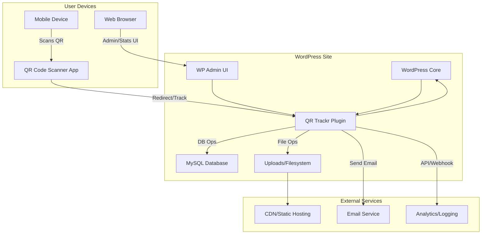

# QR Trackr Architecture

## Overview

The QR Trackr plugin is designed with a modular, standards-driven architecture that integrates seamlessly into any WordPress environment. At a high level, the system consists of three main domains:

- **WordPress Site:** The core WordPress application, the QR Trackr plugin, the admin UI, the MySQL database, and the uploads/filesystem for QR code images.
- **User Devices:** End users interact via web browsers or mobile devices, scanning QR codes and accessing tracked content.
- **External Services:** Optional integrations such as CDN/static hosting for QR images, email services for notifications, and analytics/logging endpoints for tracking and reporting.

This architecture ensures clear separation of concerns, scalability, and easy integration with both internal and external systems. All major flows—admin management, QR code generation, scan tracking, and reporting—are handled by the plugin, with extensibility points for custom workflows and integrations.

## Architecture Diagram

## Environment Architecture Note

The project now supports parallel Docker Compose environments for development (dev, port 8080) and production-like testing (nonprod, port 8081). Use `./scripts/launch-all-docker.sh` to run both in isolation. This enables rapid iteration in dev while ensuring all releases are validated in a clean, production-like WordPress instance, supporting robust modularity and QA. 

### PHPCS and Static Table Assignments
- Static table assignments (e.g., `$table = $wpdb->prefix . 'table_name';`) are flagged by PHPCS as unsafe, even when built from safe components.
- Project uses local `// phpcs:disable`/`// phpcs:enable` suppression around these assignments in `module-admin.php`.
- `.phpcs.xml` includes multiple `<exclude-pattern>` entries for maintainability, but some PHPCS versions may still flag these lines.
- Upgraded to latest PHP_CodeSniffer and WordPress Coding Standards to minimize false positives.
- If PHPCS continues to flag these, commits may be made with `--no-verify` (with justification in commit message). 