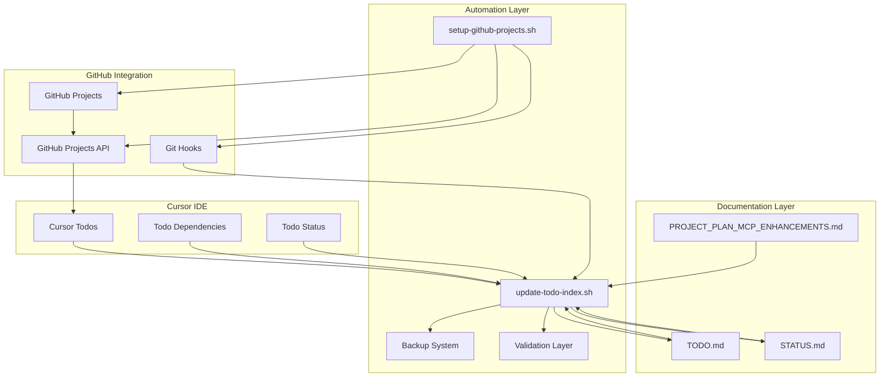
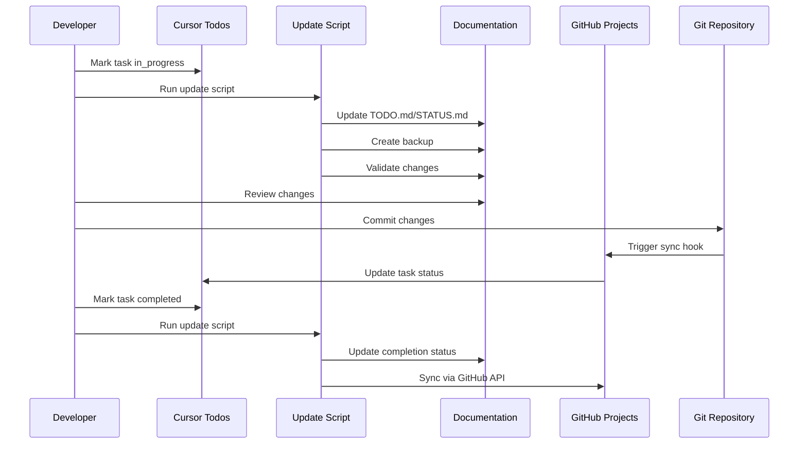

# QR Trackr Architecture

## Overview

The QR Trackr plugin is designed with a modular, standards-driven architecture that integrates seamlessly into any WordPress environment. At a high level, the system consists of three main domains:

- **WordPress Site:** The core WordPress application, the QR Trackr plugin, the modern modal-based admin UI, the MySQL database with enhanced schema, and the uploads/filesystem for QR code images.
- **User Devices:** End users interact via web browsers or mobile devices, scanning QR codes and accessing tracked content with immediate scan count updates.
- **External Services:** Optional integrations such as CDN/static hosting for QR images, email services for notifications, and analytics/logging endpoints for tracking and reporting.

This architecture ensures clear separation of concerns, scalability, and easy integration with both internal and external systems. All major flows—admin management with modal interfaces, QR code generation, real-time scan tracking, advanced search/filtering, and comprehensive debugging—are handled by the plugin, with extensibility points for custom workflows and integrations.

## Key Architectural Components

### Modal-Based Admin Interface
- **AJAX-Powered Modals:** Clickable QR images open detailed management modals with real-time editing capabilities
- **Advanced Search System:** Global search across common names, referral codes, QR codes, and destination URLs
- **Filter Integration:** Referral code dropdown filtering with search-aware caching
- **Mobile-Responsive Design:** Touch-friendly interface optimized for all device sizes

### Enhanced Database Schema
- **New Fields:** Common name and referral code fields with proper indexing for performance
- **Automatic Migrations:** Version-based database upgrades with seamless field additions
- **Caching Strategy:** Search-aware cache keys with intelligent invalidation

### Debug Mode Integration
- **System Diagnostics:** Comprehensive health checks for database, rewrite rules, and file system
- **Live Testing:** QR generation testing with visual preview and validation
- **Troubleshooting Tools:** Force flush capabilities and detailed error reporting

## Architecture Diagram

## Environment Architecture Note

The project now supports parallel Docker Compose environments for development (dev, port 8080) and production-like testing (nonprod, port 8081). Use `./scripts/launch-all-docker.sh` to run both in isolation. This enables rapid iteration in dev while ensuring all releases are validated in a clean, production-like WordPress instance, supporting robust modularity and QA. 

### PHPCS and Static Table Assignments
- Static table assignments (e.g., `$table = $wpdb->prefix . 'table_name';`) are flagged by PHPCS as unsafe, even when built from safe components.
- Project uses local `// phpcs:disable`/`// phpcs:enable` suppression around these assignments in `module-admin.php`.
- `.phpcs.xml` includes multiple `<exclude-pattern>` entries for maintainability, but some PHPCS versions may still flag these lines.
- Upgraded to latest PHP_CodeSniffer and WordPress Coding Standards to minimize false positives.
- If PHPCS continues to flag these, commits may be made with `--no-verify` (with justification in commit message). 

## Docker Volume Mount Workflow

- The `ci-runner` container mounts the local project directory (`.:/usr/src/app`).
- All linting, formatting, and testing commands run inside the container, but changes are written to the local filesystem.
- This ensures that the development, CI, and production environments are consistent.
- See the diagram below for the architecture.

### Architecture Diagram

## Project Management & Automation Architecture

### Dual TODO System Architecture
The project implements a sophisticated dual TODO system that combines modern structured task management with comprehensive documentation:

**System Components:**
- **Cursor Structured Todos:** Real-time task management with dependency tracking, status management, and development workflow integration
- **Traditional Documentation:** Historical tracking via TODO.md, STATUS.md, and PROJECT_PLAN_MCP_ENHANCEMENTS.md
- **Automation Scripts:** Bidirectional sync between systems with backup and validation
- **GitHub Projects Integration:** Live project tracking with automated field mapping

### TODO Automation System Architecture

### Automation Script Architecture

**`update-todo-index.sh` Components:**
- **Backup System:** Timestamped backups of TODO.md and STATUS.md
- **Sync Engine:** Bidirectional sync between Cursor todos and markdown files
- **Validation Layer:** File integrity checks and error handling
- **Project Summary:** Real-time metrics calculation and reporting
- **Status Updates:** Automatic completion tracking and documentation

**`setup-github-projects.sh` Components:**
- **GitHub CLI Integration:** Authentication and API access management
- **Project Creation:** Automated GitHub Projects setup with custom fields
- **Field Mapping:** Priority, Phase, Effort, and Status field configuration
- **Task Import:** Bulk task creation from Cursor todos with metadata
- **Automation Hooks:** Git hooks for continuous synchronization

### Data Flow Architecture

### Integration Benefits

**For Plugin Development:**
- **Professional project tracking** from day one
- **Automated synchronization** eliminates manual maintenance
- **Historical documentation** preserves project evolution
- **Cross-platform compatibility** works with any development environment
- **Comprehensive error handling** ensures data integrity
- **Modular design** allows easy customization for different projects

**For Development Workflow:**
- **Real-time updates** as work progresses
- **Dependency tracking** ensures proper task ordering
- **Status management** provides clear project visibility
- **Automated backups** prevent data loss
- **Validation systems** catch errors early
- **Integration hooks** maintain consistency across tools

### Scalability Considerations

**System Design:**
- **Modular architecture** allows independent component updates
- **Standardized interfaces** enable easy integration with other tools
- **Comprehensive logging** supports debugging and monitoring
- **Error recovery** handles failure scenarios gracefully
- **Performance optimization** with efficient file operations and caching

**Future Extensibility:**
- **Plugin-agnostic design** supports any WordPress plugin project
- **API-first approach** enables integration with additional tools
- **Configuration-driven** behavior allows customization without code changes
- **Documentation-first** approach ensures maintainability and knowledge transfer