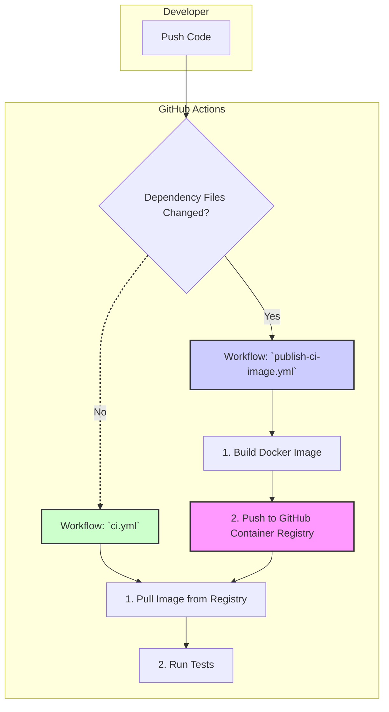
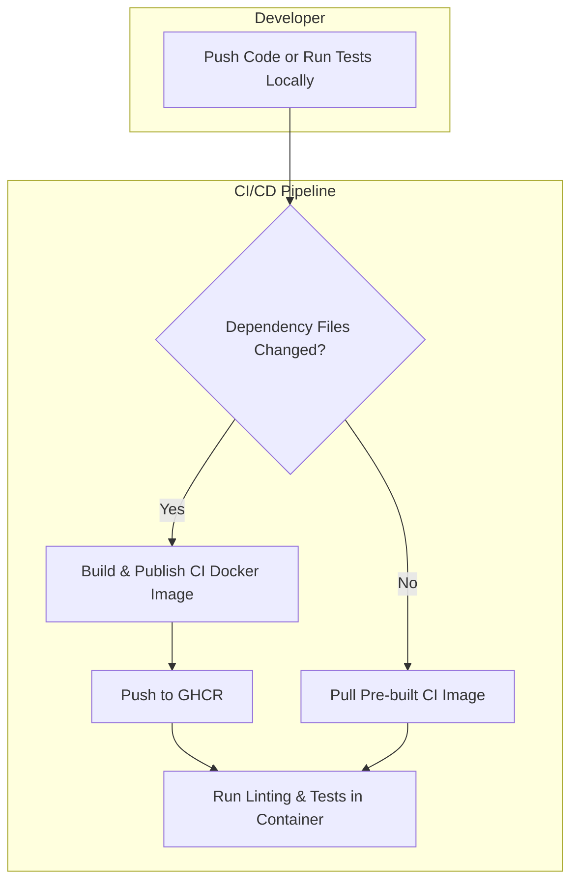

# QR Trackr Plugin Template (Development)

A modern, production-ready WordPress plugin template—featuring QR Trackr as an example. This version of the documentation is focused on local development, debugging, and contributing. The philosophy is security-first, standards-driven, with clean URLs and native redirects, local asset bundling, and Docker control scripts for everything.

## Table of Contents
1. Project Overview
2. Quick Start / Onboarding (Development)
3. Usage
4. Development & Contribution
5. Infrastructure & Plumbing
6. Troubleshooting & FAQ (Development)
7. Links & Further Reading

---

## Project Overview

**QR Trackr** is a WordPress plugin for generating and tracking QR codes for posts, pages, and custom URLs. This repository also serves as a robust template for building any modern WordPress plugin.

**Key Features:**
- Modular, scalable plugin structure
- Secure, maintainable, and extensible codebase
- Hooks/filters for free/pro separation
- Mobile-first, accessible admin UI
- Automated setup and testing
- Comprehensive PHPUnit test suite
- DigitalOcean App Platform compatibility
- Example project plans and automation scripts

---

## Quick Start / Onboarding (Development)

# 🚀 Onboarding: Zero Host Dependencies

**Requirements:**
- Docker Desktop (latest)
- Git

**How to run all development, linting, and tests:**
```sh
docker compose run --rm ci-runner vendor/bin/phpcs
docker compose run --rm ci-runner vendor/bin/phpcbf
docker compose run --rm ci-runner bash ci.sh
```

**Do NOT install PHP, Composer, Node, or CLI tools on your host.**  
All tools run inside the container, ensuring a consistent, reproducible environment.

### Prerequisites
- macOS (ARM or x86), Linux, or Windows (see project plans for cross-platform support)
- [Homebrew](https://brew.sh/) (macOS)
- [Yarn](https://yarnpkg.com/)
- [Composer](https://getcomposer.org/)
- Docker (for local dev/testing)

### Setup Steps
1. **Clone the repository:**
   ```sh
   git clone <your-fork-or-this-repo-url>
   cd wp-qr-trackr
   ```
2. **Run the setup script (macOS):**
   ```sh
   chmod +x setup-macos.sh
   ./setup-macos.sh
   ```
3. **Install dependencies:**
   ```sh
   yarn install
   composer install
   ```
4. **Set up your environment:**
   ```sh
   cp config/.env.example config/.env
   # Edit config/.env as needed
   ```
5. **Run tests:**
   ```sh
   ./vendor/bin/phpunit
   ```
6. **Start Docker for local WordPress:**
   ```sh
   docker compose up --build
   ```

> **Note:** Debug mode is enabled by default in the development environment. When using the standard Docker workflow (including `reset-docker.sh`), a `wp-config-dev.php` file is automatically included to enable `WP_DEBUG` and log errors to `wp-content/debug.log`. This ensures all PHP errors and warnings are captured for troubleshooting during development. Do not use this file in production.

### Quick Start

1. **Start the environment:**
   ```sh
   ./scripts/launch-nonprod-docker.sh
   ```
   (This script will launch the Docker environment and print access details.)

2. **Access WordPress:**
   - Open [http://localhost:8081](http://localhost:8081) in your browser.
   - Complete the WordPress install wizard (choose any admin credentials).

3. **Upload the plugin:**
   - In the WordPress admin, go to **Plugins → Add New → Upload Plugin**.
   - Select your plugin ZIP file and install/activate it.

4. **Test the plugin:**
   - Use the admin UI to verify plugin features in a clean environment.

### Database Credentials
- DB Name: `wpdb`
- DB User: `wpuser`
- DB Password: `wppass`
- MySQL Root Password: `rootpass`

### Notes
- The plugin code is **not live-mounted**; changes require re-uploading the ZIP.
- Database data persists between runs via Docker volume `db_data`.
- No other plugins or themes are pre-installed.
- **Debug logging is enabled by default in this environment.**
- **Nonprod runs on port 8081, so you can run both dev (8080) and nonprod (8081) environments at the same time.**

**Onboarding checks are automated!**
- The script `scripts/check-onboarding.sh` will run automatically before every commit.
- You can also run it manually at any time: `bash scripts/check-onboarding.sh`
- It checks for Docker, Docker running, and Git, and warns if local PHP, Composer, or Node is installed.

**Unified code validation:**
- To validate your code locally (lint, test, etc.), run:
  - `make validate`
  - or `docker compose run --rm ci-runner bash scripts/validate.sh`
- This is the same command used in CI/CD, ensuring consistency.

## Local Non-Production Docker Testing

This environment provides a clean, vanilla WordPress install for plugin testing. It is designed to:
- Simulate a real-world, production-like WordPress site with no development dependencies, no live-mounts, and no pre-installed plugins or themes.
- Allow you to upload and test your plugin ZIP file as an end user would, ensuring compatibility and catching issues that might not appear in a dev environment.
- Use a separate port (8081) so you can run both dev (8080) and nonprod (8081) environments simultaneously.

**Why?**
- This setup helps catch issues related to plugin packaging, missing dependencies, or environment differences before release.
- It ensures your plugin works on a fresh WordPress install, just like your users will experience.

### PHP Upload Limits for Plugin Testing
- The nonprod environment sets PHP upload limits using `WORDPRESS_CONFIG_EXTRA` in `docker-compose.yml`:
  ```yaml
  WORDPRESS_CONFIG_EXTRA: |
    @ini_set('upload_max_filesize', '64M');
    @ini_set('post_max_size', '64M');
  ```
- This is required because the official WordPress Docker image ignores `PHP_UPLOAD_MAX_FILESIZE` and `PHP_POST_MAX_SIZE` environment variables.
- You can now upload large plugin ZIP files for testing without hitting the "link you followed has expired" error.

## Managing the Non-Production Docker Environment

To make plugin testing easy and reliable, two scripts are provided:

### 1. Reset the Non-Production Environment
Use this to fully reset the nonprod environment, including removing all containers and the database volume for a fresh start.

```sh
./scripts/reset-nonprod-docker.sh
```
- Stops and removes all nonprod (8081) containers
- Removes the `db_data` volume (erases all nonprod database data)
- Rebuilds Docker images for a clean environment
- Use this if you want a completely fresh WordPress install and database

### 2. Launch the Non-Production Environment
Use this to start the nonprod environment after a reset, or to restart it at any time.

```sh
./scripts/launch-nonprod-docker.sh
```
- Tears down any running nonprod containers and volumes (safe to run repeatedly)
- Starts the nonprod WordPress and MySQL containers on port 8081
- Prints access instructions and tails the logs for live debugging

**Typical workflow:**
1. Reset the environment for a clean slate:
   ```sh
   ./scripts/reset-nonprod-docker.sh
   ```
2. Launch the environment and begin testing:
   ```sh
   ./scripts/launch-nonprod-docker.sh
   ```

---

## Usage

(Shared usage instructions...)

---

## Development & Contribution

### CI/CD Pipeline: A Pre-Built Container Approach

To accelerate testing and improve reliability, this project uses a sophisticated CI/CD architecture based on a pre-built Docker container. Instead of building the testing environment from scratch on every run, the pipeline pulls a stable, versioned CI container from the GitHub Container Registry (GHCR).

This approach provides two key benefits:
- **Speed:** CI checks start almost instantly, as the time-consuming step of building the Docker image is eliminated from the main workflow.
- **Reliability:** It completely avoids Docker caching issues and ensures that every test run—whether in CI or locally—uses the exact same, consistent environment.

#### Architecture Overview



#### How It Works

The system is composed of two distinct GitHub Actions workflows:

1.  **`publish-ci-image.yml` (The Builder)**
    - **Purpose:** To build and publish the CI Docker image.
    - **Trigger:** This workflow runs *only* when files defining the CI environment are changed on the `main` branch (e.g., `Dockerfile.ci`, `composer.json`, `package.json`).
    - **Action:** It builds the `ci-runner` image and pushes it to the GitHub Container Registry, where it becomes the new standard for testing.

2.  **`ci.yml` (The Tester)**
    - **Purpose:** To run all linting and testing checks on the code.
    - **Trigger:** Runs on every push and pull request.
    - **Action:**
        - It logs into the GitHub Container Registry.
        - It uses `docker-compose.ci.yml` to pull the pre-built `ci-runner` image.
        - It executes the `ci.sh` script inside the container to run all checks.

This separation of concerns ensures that the time-intensive build process only happens when absolutely necessary, making the day-to-day development and testing cycle fast and efficient.

### PHPCS Exception: Dynamic Table Name Interpolation in SQL Queries

WordPress plugins must often use dynamic table names to support multisite and custom table prefixes. This requires interpolating the table name into SQL queries, which PHPCS will flag as an error ("Use placeholders and $wpdb->prepare(); found $sql").

**Project Policy:**
- All SQL queries in this codebase use `$wpdb->prepare()` for all variable data except the table name.
- Table names are interpolated using the `$wpdb->prefix` property, following WordPress best practices.
- Each such query is annotated with a PHPCS ignore comment:
  ```php
  // phpcs:ignore WordPress.DB.PreparedSQL.InterpolatedNotPrepared,WordPress.DB.DirectDatabaseQuery.DirectQuery,WordPress.DB.DirectDatabaseQuery.NoCaching -- Table name interpolation is required for dynamic table prefixing in WordPress. All other variables are safely prepared.
  $link = $wpdb->get_row( $wpdb->prepare( $sql, $id ) );
  ```
- This is a known and accepted exception. Reviewers should not reject PRs for these PHPCS errors as long as the ignore comment and justification are present.

**References:**
- [WordPress Core Handbook: Database Access Abstraction Object (wpdb)](https://developer.wordpress.org/reference/classes/wpdb/)
- [WordPress Coding Standards: Prepared SQL](https://github.com/WordPress/WordPress-Coding-Standards/blob/develop/WordPress/Sniffs/DB/PreparedSQLSniff.php)

### Modular Linting & Formatting Configuration

To ensure code quality and consistency across all contributors and environments, this project uses a modular, extensible lint-staged configuration. This setup automatically lints and formats all relevant file types before each commit, using the right tool for each language or format. 

**Key points:**
- No `cd` commands are used in config files, avoiding path confusion and automation issues.
- All linting/formatting is run from the project root, ensuring compatibility with Husky, lint-staged, and CI/CD.
- The configuration is easily extendable for new file types or tools.
- This approach enforces standards, reduces review friction, and prevents common pitfalls in cross-platform and modular setups.

**Current `.lintstagedrc.json` config:**
```json
{
  "*.js": "eslint --fix",
  "*.jsx": "eslint --fix",
  "*.ts": "eslint --fix",
  "*.tsx": "eslint --fix",
  "*.php": "phpcbf",
  "*.css": "stylelint --fix",
  "*.scss": "stylelint --fix",
  "*.json": "prettier --write",
  "*.md": "prettier --write",
  "*.yml": "prettier --write",
  "*.yaml": "prettier --write"
}
```

**What each tool does:**
- `eslint --fix`: Lints and auto-formats JavaScript, JSX, TypeScript, and TSX files.
- `phpcbf`: Applies WordPress and project PHP coding standards automatically.
- `stylelint --fix`: Lints and auto-formats CSS and SCSS files.
- `prettier --write`: Formats JSON, Markdown, and YAML files for consistency.

**Significance:**
- **Reliability:** Avoids automation pitfalls (like infinite loops from `cd` in configs).
- **Consistency:** All code and docs are auto-formatted before commit.
- **Modularity:** Easy to add new file types or tools as the project grows.
- **Cross-platform:** Works on macOS, Linux, and CI/CD without modification.

See `scripts/.lintstagedrc.json` for the authoritative config. Update this file if you add new file types or want to change linting/formatting tools.

---

## Accidental Innovation: Documentation Orchestrator

One of the most delightful surprises in this project was the creation of a fully automated documentation orchestrator—an innovation that was never on the original roadmap, but has become a favorite feature for both development and documentation.

### What is it?
A single script, `./scripts/playwright-docs-orchestrator.sh`, gives you foolproof, on-demand, always-up-to-date documentation and accessibility screenshots for the plugin. It:
- Kills any process or container using port 8087 to avoid resource contention.
- Ensures a clean, isolated WordPress install on port 8087 (using Docker Compose and a dedicated DB volume).
- Runs the full WP-CLI setup to guarantee a fresh admin user and site state.
- Executes a Playwright user flow script that logs in, creates a QR code, and captures screenshots of every step.
- Outputs all screenshots to `assets/screenshots/` for use in documentation, accessibility reviews, and user guides.

### Why does it matter?
- **Zero manual steps:** No more worrying about stale screenshots or inconsistent docs—just run the script and everything is rebuilt from scratch.
- **Accessibility by default:** Every UI flow is captured and ready for Section 508 or WCAG review.
- **Developer and user friendly:** Anyone can generate the latest docs and screenshots, making onboarding and support easier.
- **A happy accident:** This workflow emerged from troubleshooting and automation work, and is now a core part of the dev experience.

**Try it yourself:**
```sh
./scripts/playwright-docs-orchestrator.sh
```

This will produce a complete, up-to-date set of screenshots and documentation assets for the plugin—automatically, every time.

---

## Infrastructure & Plumbing

(Shared infrastructure details, with dev notes...)

---

## Troubleshooting & FAQ (Development)

See [docs/TROUBLESHOOTING.dev.md](docs/TROUBLESHOOTING.dev.md) for help with common development issues, environment setup, and advanced debugging tips.

---

## Links & Further Reading

(Shared links...)

---

## Common Module Loading and Activation Issues

### Module Loading Order
- Modules must be loaded in the correct order to ensure all dependencies are available when needed.
- For example, if `module-admin.php` calls a function from `module-debug.php`, the debug module must be loaded first.
- Always update the main plugin file to load modules in dependency order.

### Activation Hook Pitfalls
- Activation hooks can fail if required modules or functions are not loaded before the hook runs.
- Undefined function errors (e.g., `Call to undefined function qr_trackr_is_debug_enabled()`) are usually caused by loading order issues.
- Use robust error handling and debug logging in activation hooks to catch and diagnose these problems.

### Debugging Tips
- Check `wp-content/debug.log` for fatal errors and stack traces.
- Add debug logging at the start and end of each module and activation hook.
- If you see a fatal error about an undefined function, check the module load order in your main plugin file.
- Always test plugin activation and deactivation in a clean environment to catch these issues early.

---

## Release Packaging: rsync + config/build/.distignore Exclude List

The release process uses `rsync` with an exclude list from `config/build/.distignore`.

### Why rsync + config/build/.distignore?

- **Precise control:** Only include files that should be in the release.
- **Single source of truth:** `config/build/.distignore` is the only place you need to update to add/remove files from the release.
- **Consistent builds:** Every release includes exactly the same files.
- **Easy maintenance:** Edit `config/build/.distignore` in the config directory. It works like `.gitignore` (one pattern per line).

### How to maintain the exclude list

- Edit `config/build/.distignore` in the config directory. This file controls what is excluded from the release ZIP.
- If you add new files or directories that shouldn't be in the release:
  - Add them to `config/build/.distignore` if they should not be shipped to users.
- Common exclusions: `node_modules/`, `tests/`, `docs/`, `*.log`, `*.tmp`, `.env*`
- To add or remove files from the release, just update `config/build/.distignore` and re-run the release script.

### How to build a release

1. **Copy only the required files** (using rsync and config/build/.distignore)
2. **Install production dependencies** (composer install --no-dev)
3. **Create the ZIP file** with proper folder structure
4. **Verify the build** contains only production files

---

## Technical Reference: Work Instructions

### Maintaining the Release Packaging Process
- **To add or remove files from the plugin release:**
  - Edit `.distignore` in the project root. This file controls what is excluded from the release ZIP.
  - Patterns work like `.gitignore`.
- **To build a release:**
  - Run `./scripts/build-release.sh` with the appropriate version bump argument.
- **To verify the release:**
  - Unzip the generated ZIP and confirm only the expected files and the `vendor/` directory (with production dependencies) are present.
- **If you add new dev tools, scripts, or config files:**
  - Add them to `.distignore` if they should not be shipped to users.

---

# wp-qr-trackr Development Guide

> **Note:** Sections marked with [COMMON] are shared with nonprod and production documentation.

## [COMMON] Project Overview
wp-qr-trackr is a modular, robust WordPress plugin for QR code generation and tracking. It is open source and built entirely via prompt engineering and Cursor's Agent Mode.

## Local Development Environment
- Uses Docker Compose for local WordPress + MySQL stack.
- No live-mounts in nonprod; live-mounts may be used in dev for rapid iteration.
- See `docker-compose.yml` (dev version) for service definitions.

## [COMMON] Plugin Structure
- Modular includes: admin, AJAX, rewrite, debug, utility, etc.
- Main plugin file only bootstraps modules.
- All business logic is in `includes/` modules.

## [COMMON] Coding Standards
- WordPress Coding Standards enforced via PHPCS.
- PHPCS requires at least 1GB RAM, 4GB recommended for large codebases (see `.cursorrules`).
- All code must pass CI/CD before merging.

## Development Workflow
- Use feature branches and PRs for all changes.
- Run `./scripts/build-release.sh patch` to build and verify release ZIPs.
- Use `reset-nonprod-docker.sh` to reset the nonprod environment for clean testing.

## [COMMON] Security Practices
- Separate nonces for all admin AJAX actions.
- Strict capability checks for all sensitive actions.

## [COMMON] Release Process
- Automated build script ensures only required files are included.
- Release ZIP is verified for required/forbidden files.
- Releases are published to GitHub with full changelogs.

## [COMMON] Contributor Notes
- See `.cursorrules` for project rules and environment requirements.
- All major documentation files have parallel dev, nonprod, and prod versions.
- See [CONTRIBUTING.md](CONTRIBUTING.md) for more details and a living task tracker.
- Use the provided project plans and automation scripts for team/project management.

## See also
- `README.nonprod.md` for nonprod Docker/QA environment.
- `README.prod.md` for production deployment and usage.

## All-in-One Environment

You can now start all environments (dev, nonprod, and local MCP servers) with:

```sh
./scripts/launch-all-docker.sh
```

- **Dev**: WordPress on port 8080 (live-mounts, rapid iteration)
- **Nonprod**: WordPress on port 8081 (clean, no live-mounts)
- **MCP (GitHub)**: http://localhost:7000 (repo automation, merge/conflict attention)
- **MCP (Context7)**: http://localhost:7001 (advanced documentation as a service)
- **MCP (DigitalOcean)**: http://localhost:7002 (cloud/devops automation)

See script comments for details and requirements.

---

## MCP Technical Capabilities

The following MCP servers provide native capabilities to the Cursor development environment and all plugins:

### Context7 MCP (Documentation as a Service)
- Search, retrieve, and serve advanced documentation for all plugins and codebases
- Share documentation as a service across multiple plugins
- Example commands:
  - `searchDocs(query)`: Find documentation by keyword or topic
  - `getDoc(file, section)`: Retrieve a specific doc section
  - `listDocs()`: List all available documentation topics

### GitHub MCP (Repository Automation)
- Manage PRs, branches, merges, and repo state
- Detect and resolve merge conflicts, detached HEADs, and PR attention issues
- Example commands:
  - `listPRs()`: List open pull requests
  - `mergePR(prNumber)`: Merge a pull request
  - `

## DevOps App Project Board

A new private GitHub Project, **WP QR Trackr DevOps App**, has been created to manage the migration from local development scripts to a macOS app for Docker, CI, and E2E workflow management.

- All related tasks are tracked in this project board.
- Tasks are synced between Cursor todos, markdown TODOs, and the GitHub Project using automation scripts.
- For details on the migration plan and current status, see the [MCP Enhancements Project Plan](../project/MCP_ENHANCEMENTS.md).

**How to contribute:**
- Add new DevOps/migration tasks to the Cursor TODO system or TODO.md.
- Run the automation scripts to sync with the GitHub Project.
- Reference the project board in PRs and documentation.

## Containerized CI/CD & Memory Management

## Executive Summary: Containerized Dev & CI/CD Architecture



- CI/CD uses a pre-built Docker image with 2G memory limits for Composer and PHPCS to prevent OOM errors.
- Local development does not enforce these limits by default, but you can set COMPOSER_MEMORY_LIMIT=2G and php -d memory_limit=2G if you encounter memory issues.
- Only supported PHPCS sniffs (wpcs, phpcsutils) are used; legacy sniffs have been removed.
- See docs/TROUBLESHOOTING.md for troubleshooting Composer/PHPCS and VCS issues.

## Lessons Learned

### Platform-Specific Learnings (PHP/WordPress)
- **Restrict PHPCS to PHP files:** Always use the `--extensions=php` flag with PHPCS in CI/CD to avoid memory issues and unnecessary linting of non-PHP files.
- **Using Cursor as an Assistant:** Cursor's AI assistant was invaluable for rapid troubleshooting, configuration, and documentation.
- **Modular Configurations:** Keeping configuration modular (Docker, Composer, PHPCS, etc.) improved maintainability and clarity.
- **Defining and Implementing Best Practices:** Proactively defining and enforcing best practices for dev environments (memory, dependencies, standards) resulted in a more robust workflow.

## Security Best Practices

All forms and data-changing actions in QR Trackr are protected by WordPress nonces and server-side verification:

- **Admin forms** (e.g., create, edit, delete QR codes) include a nonce field and verify it server-side before processing.
- **AJAX endpoints** require a valid nonce and verify it using `check_ajax_referer()` or `wp_verify_nonce()`.
- **Bulk and destructive actions** (such as deleting QR codes) are protected by nonces in both the action link and the handler.
- **Settings and debug forms** use `wp_nonce_field()` and verify with `check_admin_referer()`.

This ensures robust protection against CSRF and other attacks, fully complying with WordPress security standards and project rules. All new features must include nonce protection for any form or data-changing action.

## Linting and PHPCS Configuration

### PHP_CodeSniffer (PHPCS) Setup

- PHPCS is configured via `config/ci/.phpcs.xml` in the config directory.
- Only source files in `wp-content/plugins/wp-qr-trackr/qr-trackr.php` and `wp-content/plugins/wp-qr-trackr/includes/` are explicitly included for linting.
- The `build/` directory and all its subdirectories are excluded using `<exclude-pattern>build/**</exclude-pattern>` in `config/ci/.phpcs.xml`.
- The CI script (`ci.sh`) uses the `--ignore='vendor/*,build/**'` flag in all PHPCS invocations to ensure build artifacts are never linted, preventing duplicate or false-positive errors.
- This setup avoids issues where PHPCS would lint both source and build output, causing confusing or duplicate errors, especially for files that are copied or transformed during the build process.
- If you add new directories for build or generated files, update both `config/ci/.phpcs.xml` and the `--ignore` flags in your scripts.

### Lessons Learned

- Always exclude build and generated directories from PHPCS to avoid false positives and duplicate errors.
- Use both `config/ci/.phpcs.xml` patterns and explicit `--ignore` flags in CI scripts for maximum reliability across environments.
- If you see errors referencing files or lines that don't exist in your source, check if build artifacts are being linted.
- Restrict `<file>` entries in `config/ci/.phpcs.xml` to only your actual source code.

## Containerized Development & Linting

- All code formatting, linting, and testing should be run inside the Docker container using the local volume mount (`.:/usr/src/app`).
- This ensures that any changes (e.g., PHPCBF autofixes) are made directly to your local files, but using the exact environment and dependencies as CI/CD.
- This eliminates "works on my machine" issues and guarantees that code passing locally will also pass in CI.
- To run PHPCS/PHPCBF or tests, always use `docker compose run --rm ci-runner ...`.
- See the architecture diagram below for the workflow.

## Running Tests Locally with Docker

To ensure consistent test execution across different development environments, we use Docker containers for running tests locally. This mirrors our CI environment and helps catch issues early.

### Prerequisites

- Docker and Docker Compose installed on your system
- Git repository cloned locally

### Running Tests

1. Start the test environment:
```bash
# Use the CI-specific compose file
docker-compose -f docker-compose.yml -f docker-compose.ci.yml up -d
```

2. Run the test suite:
```bash
# Execute tests inside the container
docker-compose -f docker-compose.yml -f docker-compose.ci.yml exec ci-runner ./ci.sh
```

The `ci.sh` script will:
- Wait for the database to be ready
- Install Composer dependencies
- Run PHPCS (PHP CodeSniffer) checks
- Run Stylelint for CSS files
- Run ESLint for JavaScript files
- Set up WordPress test environment
- Run PHPUnit tests

### Understanding Test Components

- **PHP Tests**: Located in `tests/` directory, using PHPUnit
- **Coding Standards**: PHPCS configuration in `.phpcs.xml`
- **JavaScript/CSS Linting**: Configuration in `config/editor/eslint.config.js` and `config/ci/.stylelintrc.json`

### Troubleshooting

If you encounter memory issues during test execution:
1. The containers are configured with appropriate memory limits
2. PHPCS memory limit is set to 2GB
3. Composer memory limit is set to 2GB

For other issues, check:
- Database connection (container `db-nonprod` should be running)
- Container logs: `docker-compose -f docker-compose.yml -f docker-compose.ci.yml logs`
- WordPress test environment setup in container

### Clean Up

After testing, stop and remove the containers:
```bash
docker-compose -f docker-compose.yml -f docker-compose.ci.yml down
```

## E2E Testing: Config-Driven Workflow

To ensure consistency and minimal local dependencies, all end-to-end (E2E) tests are run using Docker Compose and a central configuration file.

- **Config file:** `config/testing/e2e.config.json` tracks the Docker Compose file, service, Playwright config, test directory, environment variables, and dependencies.
- **Wrapper script:** `run-e2e.sh` reads the config and runs Playwright E2E tests in Docker using the correct settings.

### How to Run E2E Tests

1. Ensure Docker is running and you have all dependencies installed (see project setup).
2. From the project root, run:
   ```sh
   bash run-e2e.sh
   ```
3. The script will:
   - Parse `config/testing/e2e.config.json` for all required paths and settings.
   - Export any environment variables defined in the config.
   - Run Playwright E2E tests in the correct Docker container and environment (**ci-runner** only).

**Important:**
- The **nonprod** environment is for manual verification only. It does **not** include Playwright or dev tools, and should not be used to run automated E2E tests.
- Use **ci-runner** or **dev** containers for all automated E2E and integration testing.

**Benefits:**
- No need to remember Compose file names or service names.
- All contributors and CI/CD use the same workflow.
- Easy to update dependencies and paths in one place.

For more details, see the comments in `config/testing/e2e.config.json` and `run-e2e.sh`.